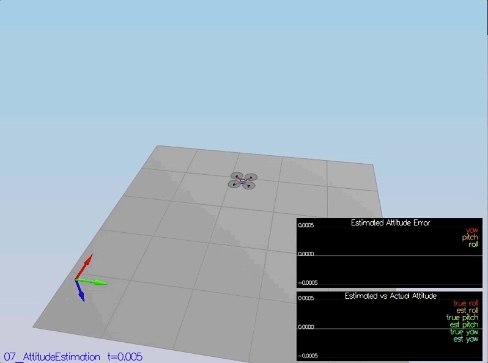
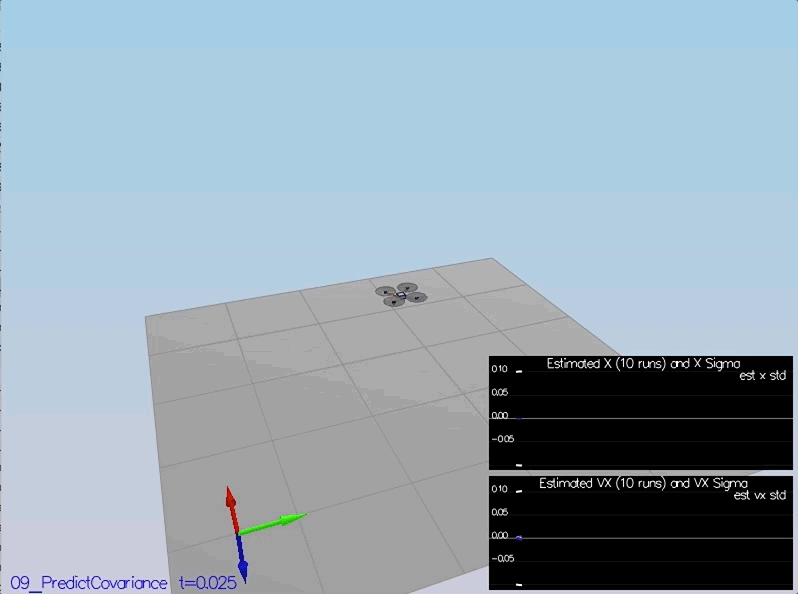

# FCND Project Submission #

This is the readme for the C++ estimation project for FCND course offered by Udacity. The file include all the rubric points and how they were addressed and specifically where in the code each step was handled.
More details about the project devoloped by Udacity, contributors, and licensing, can be found [here](../master/README_Udacity.md).

## Implemented Estimator ##

### Determine measurement noise GPS and Accelerometer. ###
Using the following python code, `MeasuredStdDev.py`, the computed standard deviation from sensor data correctly capture ~68% of the measurements.

```py
import fileinput
import pandas

GPSPosXY = pandas.read_csv("./config/log/Graph1.txt", sep=",", header=None, skiprows=1)
AccelXY  = pandas.read_csv("./config/log/Graph2.txt", sep=",", header=None, skiprows=1)

_ , MeasuredStdDev_GPSPosXY = GPSPosXY.std(axis=0)
_ , MeasuredStdDev_AccelXY = AccelXY.std(axis=0)

print('MeasuredStdDev_GPSPosXY = %0.2f' % MeasuredStdDev_GPSPosXY)
print('MeasuredStdDev_AccelXY = %0.2f' % MeasuredStdDev_AccelXY)
```


### Rate gyro attitude integration `UpdateFromIMU()`. ###
Using quaternions, an improved integration scheme was achieved.


```cpp
Quaternion<float> quat = Quaternion<float>::FromEuler123_RPY(rollEst, pitchEst, ekfState(6));
quat.IntegrateBodyRate(gyro, dtIMU);

float predictedPitch = quat.Pitch();
float predictedRoll = quat.Roll();
ekfState(6) = quat.Yaw();

// normalize yaw to -pi .. pi
if (ekfState(6) > F_PI) ekfState(6) -= 2.f*F_PI;
if (ekfState(6) < -F_PI) ekfState(6) += 2.f*F_PI;
```


### Prediction step for the estimator `Predict()`. ###
The prediction step was implemented and it included the state update element, the calculation of the Rgb prime matrix using the function `GetRbgPrime()`, and the update of the state covariance. The acceleration was accounted for as a command in the calculation of gPrime. The covariance update should follow the classic EKF update equation.

```cpp
predictedState(0) = curState(0) + dt * curState(3);
predictedState(1) = curState(1) + dt * curState(4);
predictedState(2) = curState(2) + dt * curState(5);
predictedState(3) = curState(3) + dt * attitude.Rotate_BtoI(accel).x;
predictedState(4) = curState(4) + dt * attitude.Rotate_BtoI(accel).y;
predictedState(5) = curState(5) + dt * attitude.Rotate_BtoI(accel).z - dt * CONST_GRAVITY;
```

### Magnetometer update `UpdateFromMag()`. ###
The update included the magnetometer data into the state. 

```cpp
hPrime(6) = 1;
zFromX(0) = ekfState(6);
if (magYaw - ekfState(6) > F_PI) zFromX(0) += 2.f*F_PI;
if (magYaw - ekfState(6) < -F_PI)zFromX(0) -= 2.f*F_PI; 
```


### Implement the GPS update. ###
The estimator should correctly incorporate the GPS information to update the current state estimate.

```cpp
hPrime(0,0) = 1;
hPrime(1,1) = 1;
hPrime(2,2) = 1;
hPrime(3,3) = 1;
hPrime(4,4) = 1;
hPrime(5,5) = 1;

//zFromX = ekfState;
zFromX(0) = ekfState(0);
zFromX(1) = ekfState(1);
zFromX(2) = ekfState(2);
zFromX(3) = ekfState(3);
zFromX(4) = ekfState(4);
zFromX(5) = ekfState(5);
```


## Flight Evaluation ##

### Meet the performance criteria. ###
The estimator was able to successfully meet the performance criteria with the controller provided. All its parameters were properly adjusted to satisfy those criteria.

#### Scenario 6: ####
<p align="center">

</p>

#### Scenario 7: ####
<p align="center">

</p>

#### Scenario 8: ####
<p align="center">

</p>

#### Scenario 9: ####
<p align="center">

</p>

#### Scenario 10: ####
<p align="center">

</p>

#### Scenario 11: ####
<p align="center">

</p>

### De-tune controller. ###
The controller developed in the previous project after the de-tuned was able to successfully meet the performance criteria of the final scenario (<1m error for entire box flight).

